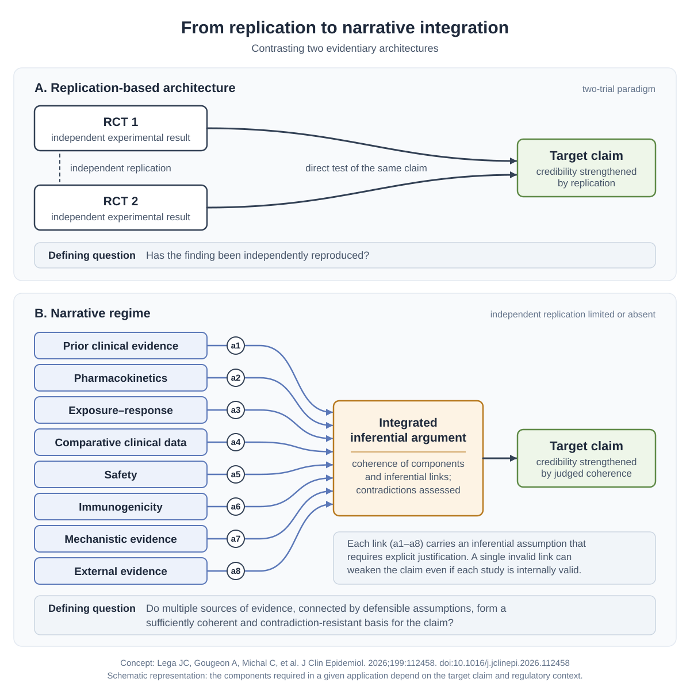

# Narrative regime

A living methodological resource on the narrative regime of evidence in health technology assessment and drug regulation.

The concept was introduced by Lega et al. to describe an evidentiary configuration in which justification relies primarily on the coherence and integration of heterogeneous evidence when independent experimental replication is limited or absent.

This repository provides:

- a canonical definition of the concept;
- a comparison with replication-based evidentiary architectures;
- an explicit representation of inferential links and assumptions;
- worked examples;
- characteristic failure modes;
- a practical framework for auditing narrative evidentiary claims.

## Start here

- [Canonical concept page](narrative-regime.md)
- [Worked example: IV-to-SC bridging](examples/iv-to-sc-bridging.md)
- [References](references.md)
- [Changelog](CHANGELOG.md)

## From replication to narrative integration

  <picture>
    <source media="(prefers-color-scheme: dark)" srcset="figures/replication-vs-narrative-integration-dark.svg">
    <source media="(prefers-color-scheme: light)" srcset="figures/replication-vs-narrative-integration-light.svg">
    
  </picture>

**Figure.** From replication to narrative integration. (A) In a replication-based architecture, independent trials test the same claim directly; the defining question is whether the finding has been independently reproduced. (B) In a narrative regime, heterogeneous evidence components are combined through inferential links, each carrying an assumption that requires justification; the defining question is whether these sources, connected by defensible assumptions, form a sufficiently coherent and contradiction-resistant basis for the claim. The figure is schematic: the components required depend on the target claim and regulatory context. Concept: Lega et al., *J Clin Epidemiol* 2026;199:112458.

## Status

Version 1.0 — October 2026.

The “narrative regime” is an analytical construct, not a formal regulatory category. This repository is intended as a living methodological resource. Subsequent extensions should remain distinguishable from the definition and claims made in the primary publication.

## Primary publication

Lega JC, Gougeon A, Michal C, Provencher S, Naudet F, Falissard B, Chevret S, Boussageon R. The erosion of proof in paradigm transitions: the rise of narrative rationality in health technology assessment. J Clin Epidemiol. 2026;199:112458. doi:10.1016/j.jclinepi.2026.112458.

## Citation

See [CITATION.cff](CITATION.cff).
